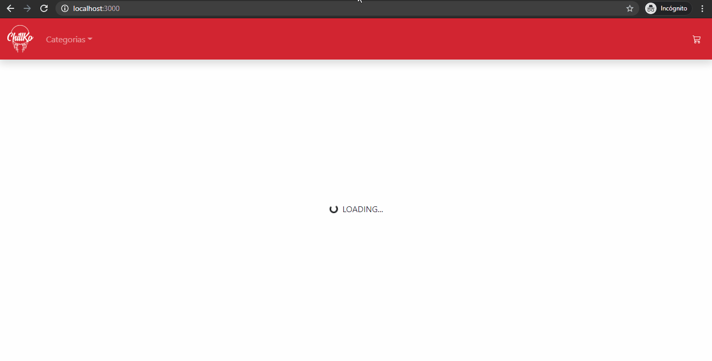
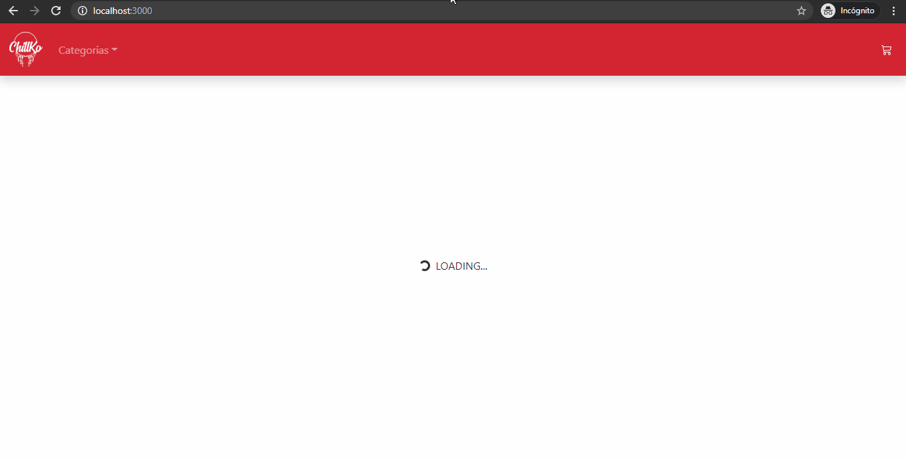
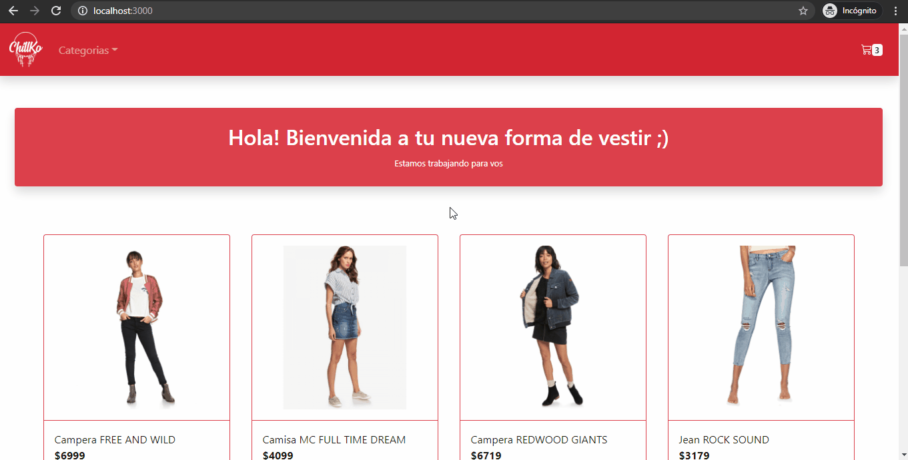

# Chk-Store

Chk Store es un E-Commerce de indumentaria destinado a aquellas mujeres disruptivas que buscan empoderarse a traves de un estilo unico. La aplicacion fue creada haciendo uso de [Create React App](https://github.com/facebook/create-react-app) y [Firestore](https://firebase.google.com/products/firestore) y aun se encuentra en desarrollo. Si queres contribuir a esta nueva forma de vestir no dudes en contactarte conmigo.

## Caracteristicas

- [x] Navegacion por listado de productos.
- [x] Visualizacion del detalle de un producto.
- [x] Navegacion por categorias.
- [x] Carrito de compras.
- [x] Creacion de ordenes de compra.
- [ ] Cuentas de usuario.
- [ ] Lista de favoritos.
- [ ] Lista de ordenes realizadas.
- [ ] Opcion de guardar el carrito.

## Instalacion

En el directorio del proyecto, puedes ejecutar:

`npm start`

Inicia la aplicacion en modo desarrollo. 
Abre [http://localhost:3000](http://localhost:3000) para verla en el navegador.

La pagina se va a recargar si haces cambios y puedes ver cualquier error en la consola.

`npm run build`

Prepara la aplicacion para produccion, dentro de la carpeta `build`. 
Compila la aplicacion en modo produccion y optimiza el codigo para obtener el mejor rendimiento. 
La aplicacion queda lista para ser desplegada.

Mira la seccion [despliegue](https://facebook.github.io/create-react-app/docs/deployment) para mas informacion.

## Uso
### Filtrar por categorias

### Agregar producto al carrito

### Confirmar compra

## Como contribuir
- Fork
- Pull Request
